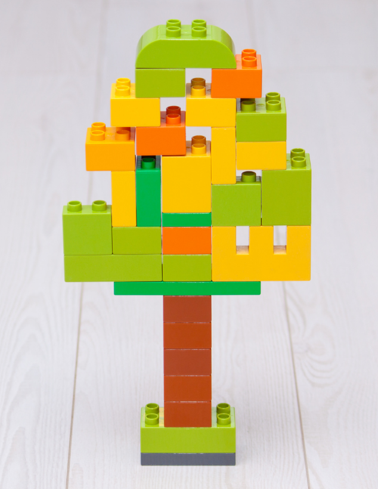

# BEM Notation and Object Oriented CSS

A project on how to write scaleable CSS using BEM notation and OOCSS

# What is OOCSS? 🧐

OOCSS (Object Oriented CSS) is a methodology created by ([Nicole Sullivan](https://github.com/stubbornella/oocss/wiki) 2008), for writing CSS that abstracts away CSS repetition into reusable "objects".

## What is a CSS "object"?

A CSS "object" is:

"...a repeating visual pattern, that can be abstracted into an independent snippet of HTML, CSS, and possibly JavaScript. That object can then be reused throughout a site" - [Object Oriented CSS](https://github.com/stubbornella/oocss/wiki)

With enough small, re-usable snippets, we can use these like lego blocks to build and create something totally new. A CSS object should aim to do *one* thing *well*.



There are two main principles of OOCSS that will help you write CSS that follows a more Object Oriented approach.

These are:

## Separation of Structure from Skin

Separation of Structure from Skin means differentiating between repeatable, "invisible" patterns such as height, width, padding, margin, overflow etc from repeatable visible ones such as colours, fonts, shadows or gradients of an element.

For example, if we had three buttons that all looked the same apart from their colour, we would add the structure of the buttons (their height, width, border radius etc) into the button class. We would then create additional classes that can apply different "skins" (individual colours or styling) to the buttons and add these additional classes wherever needed.

Before OOCSS code might look like this:

```
.button {
  width: 7rem;
  padding: 5px;
  border-radius: 4px;
  text-align: center;
  font-size: 1rem;
  background: white;
}

.button1 {
  width: 7rem;
  padding: 5px;
  border-radius: 4px;
  text-align: center;
  font-size: 1rem;
  background: green;
}

.button2 {
  width: 7rem;
  padding: 5px;
  border-radius: 4px;
  text-align: center;
  font-size: 1rem;
  background: red;
}
```

Using OOCSS you can reduce your code to:

```
/* Structure */

.button {
  width: 7rem;
  padding: 5px;
  border-radius: 4px;
  text-align: center;
  font-size: 1rem;
}

/* Skins */

.buttonSuccess {
  background: green;
}

.buttonDanger {
  background: red;
}
```


The HTML:

```
<button class="button">Default</button>
<button class="button buttonSuccess">Success</button>
<button class="button buttonDanger">Danger</button>

```

These buttons "inherit" their main styles from the button class and "extend" with their own individual styling. By doing this, our repeated code is abstracted away into a repeatable button class, reducing repetition in our code.


## Separation of Container and Content

Try not to style elements based on their *location*. A reusable CSS object should look the same wherever you use it.

Rather than styling a specific ```<h2>``` with for example, ```.banner h2 {...}``` create and apply a class that describes the ```<h2>``` in question, like ```<h2 class="banner">```.

This has multiple benefits such as reusability, consistency across all unclassed ```<h2>s``` and ```<h2>s``` with the ```.banner``` class. It also means you won't have to override ```.banner <h2>``` if there is a time it needs to look like a regular ```<h2>```.

Content that inherits styles based on their container/location:

```
#sidebar {
  padding: 2px;
  left: 0;
  margin: 3px;
  position: absolute;
  width: 140px;
}

#sidebar .list {
  margin: 3px;
}

#sidebar .list .list-header {
  font-size: 16px;
  color: red;
}
```

Content and container separated (OOCSS):

```
.sidebar {
  padding: 2px;
  left: 0;
  margin: 3px;
  position: absolute;
  width: 140px;
}

.list {
  margin: 3px;
}

.list-header {
  font-size: 16px;
  color: red
}
```

Unique elements are given unique classes. Avoiding child selectors is a good approach for maintaining separation of content and containers.


## What is BEM? 🧐

BEM notation ([Yandex](https://en.bem.info/methodology/) 2009), is a CSS naming convention designed to keep CSS understandable and scaleable by avoiding naming conflicts and specificity wars. Creating CSS "Blocks" keeps code modular and re-usable, reducing the amount of code we have to write. Yay.

BEM stands for Block Element Modifier and has a high adoption rate amongst developers due to its low cost, ease of use - and success!

OOCSS and BEM are two separate methodologies, but essentially OOCSS defines good architecture and BEM gives those concepts a recognisable, easy to understand terminology.

Lets break it down...


## Block

A "Block" is a standalone entity that is meaningful on its own.

Some "Block" examples might be: buttons, headers, containers, cards, list and input


## Element

An "Element" is part of a block. An element has no meaning on its own.

For example, some "Elements" would be: button text, header title, list item, container card.

Each element belongs to its block parent. A headers title. A lists item etc.

A double underscore __ means *inside* the block


## Modifier

A "Modifier" changes - or modifies 😉 - a block or elements appearance or behaviour.

For example, some "Modifiers" might be: disabled, on/off, size small, colour red etc

Double hyphen -- signals a modifier.

------

Here are some examples in code:

```
/* Block component */

.button {}

/* Element that depends upon the block or is *inside* the block */

.button__text {}
.card__img {}

/* Modifier that changes the style of the block or element */

.button--disabled {}
.button--small {}

/* Used together they might look something like this: */

.button__text--disabled {}
```


## Conclusion

There is no strict, "right" or "wrong" way to architect CSS. However, developers across the globe have found abstracting away repetition into reusable building blocks (like lego!) and following a clear naming convention helps ease code bloat, ensures separation of concerns and helps readability.

Thinking carefully about how we structure code benefits projects as they grow! 🌱 🙌


## BEM and OOCSS in Practice 👩‍🎨

Now you understand what BEM and OOCSS are, it's time to put these sweet new learnings into practice!

After forking this repository you will need to clone the repo locally and open up your index.html file in the browser.

Type 'open index.html' in your terminal and press enter (make sure you're in the right directory!). Your Star / BEM / OOCSS Wars page should open in your browser. Alternatively, right click on your index.html file and select 'open with..' then select the browser of your choice.

You should now see pictures of Darth Vader and Yoda on your screen. 🪐


## The Challenge 🤺

The internet is being destroyed by unscalable, unmanageable CSS! Specificity wars are everywhere, elements are lost in the deep dark depths of nesting and fleets of developers are fleeing in their droves!

But! Rebellions are built on hope, Skywalker... and a little more knowledge around CSS methodologies lights our way. 🕊

In your index.html file you must work with ~~Yoda~~ BEM/OOCSS to create a more manageable, more zen web page.


## The Rulez 😒

Your project should have:

- One bright coloured card for Yoda, The Force and BEM/OOCSS.

- One dark coloured card for Darth Vader and his CSS hell!

- Card styling like borders, padding, shadows etc

- BEM notation to clearly name and structure your CSS to target block, elements and modifiers on the page

- OOCSS to avoid duplication in your code. Remember, "block" styles will affect *all* cards whereas your modifier styles will change *specific*, or *individual* things, like the colour of your cards.

- No Ids. This is because BEM/OOCSS recommend avoiding Ids because Ids are unique which means they cannot be reused. Using classes avoids specificity wars (if everything is a class, everything has a specificity of 10 which is easy to remember and easy to override 😉).

- Try not to select elements using their tag names. On large projects, targetting ```p``` when there are lots of ````ps```` can get dangerous! 🙈 So again, give classes to everything.

- Comments to clearly separate your CSS content i.e. structure vs skins


## Extension 🔥

- Using flexbox make your cards sit side by side, in the middle of the page

- Create a button for each card. A red warning/danger button for Darth Vader and an opposing button for Yoda

- Add a couple more cards with the same base styles (and buttons) of The Dark Side and The Force cards but with different colours and images. Get as creative as you like!


If you've got this far then the BEM/OOCSS force is with you, Skywalker! Great job! 🙏 ✨ 🧘‍♀️
